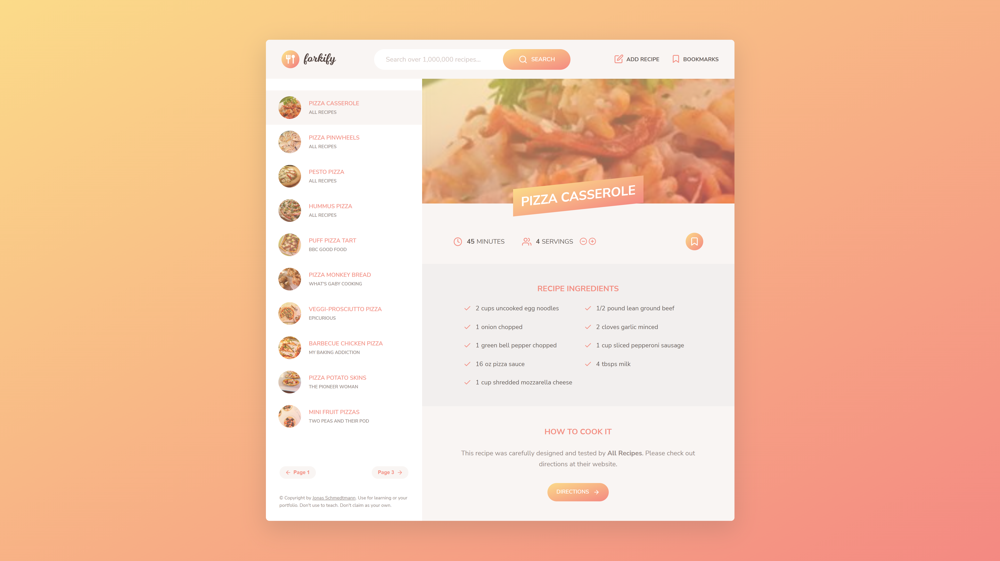

# <a href="https://saber-recipes.netlify.app" target="_blank">Forkify</a>

Vanilla JavaScript application that interacts with the Forkify API to fetch and display recipe food data. This app uses modern JavaScript tools, such as Webpack to bundle the modules, and Babel to convert ES6, ES7 and ES8 back to ES5. The user can search for a specific recipe, and save to a favorites list via local storage. The user can easily increase or decrease servings as per his need and can view detailed directions.

## Built With

Pure vanilla JavaScript  along with HTML  and SCSS. It uses webpack as module bundler and NPM as package manager.

## <a href="https://saber-recipes.netlify.app" target="_blank">Usage</a>

The Forkify Recipe App allows users to search for recipes, users can view the recipe along with the cook time and also increase or decrease the amount of servings they need, users can also bookmark recipes, then they will stored in local storage so no database was required for this application.

For more examples, please refer to the <a href="https://forkify-api.herokuapp.com/v2" target="_blank">Documentation</a>

## <a href="https://saber-recipes.netlify.app" target="_blank">Hero</a>

